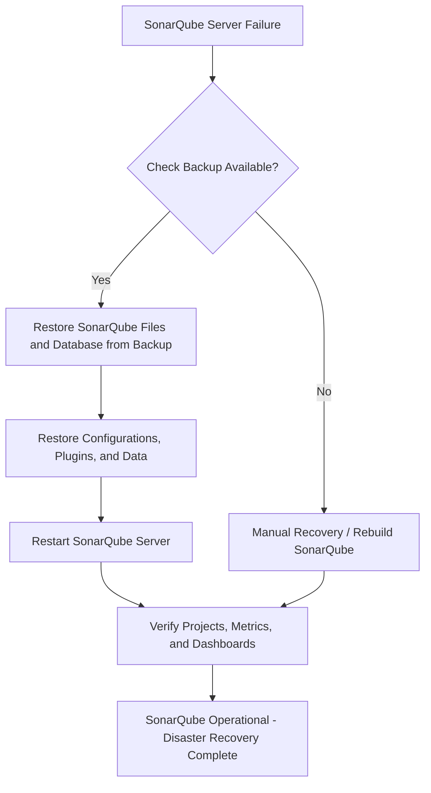

# SonarQube - Disaster Recovery

---

## Author Information
| Last Updated On | Version | Author           | Level           | Reviewer               |
|-----------------|---------|------------------|-----------------|------------------------|
| 15-08-2025      | V1.0    | Kawalpreet Kour  | Internal Review | Pritam                 |
|                 |         | Kawalpreet Kour  | L0              | Shreya/Sharvari        |
|                 |         | Kawalpreet Kour  | L1              | Abhishek V             |
|                 |         | Kawalpreet Kour  | L2              | Abhishek Dubey/Rishabh sharma |

---

  
<h2><strong>Table of Contents</strong></h2>

- [Introduction](#introduction)  
- [What is Disaster Recovery?](#what-is-disaster-recovery)  
- [Why we need disaster recovery in SonarQube?](#why-we-need-disaster-recovery-in-sonarqube)  
- [Workflow](#workflow)  
- [SonarQube Backup, Recovery, and MTTR](#sonarqube-backup-recovery-and-mttr)  
- [Advantages & Disadvantages](#advantages--disadvantages)  
- [Best Practices](#best-practices)  
- [Conclusion](#conclusion)  
- [FAQs](#faqs)  
- [Contact Information](#contact-information)  
- [References](#references)  

---

## Introduction

This document provides a comprehensive overview of SonarQube Disaster Recovery, including best practices, Mean Time to Recovery (MTTR), workflow diagrams, advantages and disadvantages.

---

## What is Disaster Recovery?

Disaster recovery (DR) is the process and plan an organization uses to restore its IT infrastructure and operations after a disruption or disaster.
In SonarQube, disaster recovery refers to the processes and strategies employed to restore SonarQube functionality, configuration, and data after an unexpected failure, such as server crash, data corruption, or plugin failure.

---

##  Why we need disaster recovery in SonarQube?

| Reason | Explanation |
|--------|-------------|
| Protect Against Data Loss | SonarQube stores project analysis, metrics, user settings, and plugin configurations. DR prevents losing critical data due to crashes or accidental deletion. |
| Ensure Business Continuity | If SonarQube is down, developers cannot see quality reports, potentially blocking releases. DR ensures continuity. |
| Minimize Downtime | A good DR plan restores SonarQube quickly, reducing lost productivity. |
| Handle Unexpected Failures | Servers can fail due to hardware, OS, network issues, or human error. DR ensures SonarQube is quickly recoverable. |
| Compliance & Audit Requirements | Audit logs and quality reports are often needed for compliance. DR preserves them. |
| Plugin & Configuration Recovery | SonarQube uses multiple plugins and configurations. DR allows restoring these consistently. |

---

## Workflow

---

## SonarQube Backup, Recovery, and MTTR

### SonarQube Backup & Recovery Commands

#### Backup Database (PostgreSQL example)
pg_dump -U sonar -h localhost sonarqube_db > sonarqube_backup_$(date +%F).sql  
>*Backup PostgreSQL database 'sonarqube_db' as user 'sonar' and save with current date.*

ls -lh sonarqube_backup_*.sql  
>*List database backup file with human-readable size.*

#### Backup SonarQube Files
sudo tar -czvf sonarqube_files_backup_$(date +%F).tar.gz /opt/sonarqube  
>*Compress entire SonarQube home folder '/opt/sonarqube' into a dated '.tar.gz' archive.*

ls -lh sonarqube_files_backup_*.tar.gz  
>*Verify backup archive file and its size.*

---

### Recovery: Steps to restore SonarQube

#### Stop SonarQube Service
sudo systemctl stop sonarqube  
>*Stop the running SonarQube service to safely restore files and database.*

#### Restore Files
sudo tar -xzf sonarqube_files_backup_2025-08-15.tar.gz -C /opt/sonarqube  
>*Extract previously backed-up files into SonarQube home directory.*

sudo chown -R sonarqube:sonarqube /opt/sonarqube  
>*Set proper ownership of restored files to 'sonarqube' user.*

#### Restore Database
psql -U sonar -d sonarqube_db -h localhost -f sonarqube_backup_2025-08-15.sql  
>*Restore PostgreSQL database from backup SQL file as user 'sonar'.*

#### Start SonarQube Service
sudo systemctl start sonarqube  
>*Start the SonarQube service after successful file and database restore.*

#### Verify Service
sudo systemctl status sonarqube  
>*Check if SonarQube service is active and running.*

#### Open browser to verify dashboards, projects, and metrics

http://<server-ip>:9000  

>*Verify SonarQube dashboards, projects, and metrics.*

### MTTR (Mean Time to Recovery)

Average time to restore SonarQube after failure.

| Backup Method | Relative Recovery Speed |
|---------------|-------------------------|
| Local backup + manual restore | Slower than cloud or automated methods |
| Cloud backup + manual restore | Faster than local restore, moderate speed |
| Automated scripts (IaC/Ansible) | Faster recovery |
| HA (High Availability) setup | Fastest, near-instant failover |

---

## Advantages & Disadvantages

| Advantage | Description |
|-----------|-------------|
| High Availability | HA setup allows near-zero downtime during server failures. |
| Minimal Downtime | Quick restoration reduces impact on development teams. |
| Data Protection | Backups of configuration, plugins, and DB preserve critical metrics. |
| Reduced Business Impact | DR ensures development, audits, and releases continue smoothly. |

---
| Disadvantage | Description |
|-------------|-------------|
| Complexity | DR setup with backups, DB dumps, and HA can be technical. |
| Storage | Full backups may need significant space. |
| Partial Recovery | In-progress analyses or temporary caches may be lost. |
| Cost | HA or cloud storage can be expensive. |

---

## Best Practices

| Best Practice | Description |
|---------------|-------------|
| Regular Backups | Take daily or frequent backups of files and DB. |
| Offsite Storage | Keep backups on cloud or remote servers. |
| Automated DB Backups | Use scripts to dump DB automatically. |
| Version Control | Store configs, scripts, and plugins in Git. |
| Plugin Management | Keep only required plugins and track versions. |
| High Availability | Use HA or clustering to reduce downtime. |
| Test Recovery | Periodically test backups to ensure they work. |

---

## Conclusion

SonarQube Disaster Recovery ensures continuous code quality monitoring. Regular backups, offsite storage, automation, and high availability minimize downtime, protect data, and keep development running smoothly.

---

## FAQs

1. **What should be backed up?**  
   - Important items include `conf/`, `data/`, `extensions/plugins/`, custom scripts, and the database dump.

2. **Can DR be automated?**  
   - Yes, using scripts or Infrastructure as Code (IaC) tools like Ansible or Terraform.

3. **How often should backups be taken?**  
   - Backups should be taken nightly or after any critical changes to ensure data can be restored quickly.

---

## Contact Information

| Name             | Email                          |
|------------------|--------------------------------|
| Kawalpreet Kour  | kawalpreet.kour.snaatak@mygurukulam.co |

---

## References

| Description                               | Link                                                                 |
|-------------------------------------------|----------------------------------------------------------------------|
| Official SonarQube 10.8 Documentation    | [SonarQube Server 10.8 Docs](https://docs.sonarsource.com/sonarqube-server/10.8/) |
| Community Discussion on DR Setup          | [SonarQube DR Setup Thread](https://community.sonarsource.com/t/sonarqube-dr-setup/113338) |
