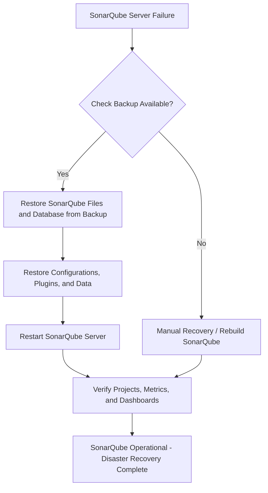

# SonarQube - Disaster Recovery

---


---

## Author Information
| Last Updated On | Version | Author           | Level           | Reviewer               |
|-----------------|---------|------------------|-----------------|------------------------|
| 15-08-2025      | V1.0    | Kawalpreet Kour  | Internal Review | Pritam                 |
|                 |         | Kawalpreet Kour  | L0              | Shreya/Sharvari        |
|                 |         | Kawalpreet Kour  | L1              | Abhishek V             |
|                 |         | Kawalpreet Kour  | L2              | Abhishek Dubey/Rishabh sharma |

---

<details>
  <summary><h2><strong>Table of Contents</strong></h2></summary>

- [Introduction](#introduction)  
- [What is Disaster Recovery?](#what-is-disaster-recovery)  
- [Why we need disaster recovery in SonarQube?](#why-we-need-disaster-recovery-in-sonarqube)  
- [Workflow](#workflow)  
- [SonarQube Backup, Recovery, and MTTR](#sonarqube-backup-recovery-and-mttr)  
- [Advantages & Disadvantages](#advantages-&-disadvantages)  
- [Best Practices](#best-practices)  
- [Conclusion](#conclusion)  
- [FAQs](#faqs)  
- [Contact Information](#contact-information)  
- [References](#references)  

</details>


---

## Introduction

This document provides a comprehensive overview of SonarQube Disaster Recovery, including best practices, Mean Time to Recovery (MTTR), workflow diagrams, advantages and disadvantages.

---

## What is Disaster Recovery?

Disaster recovery (DR) is the process and plan an organization uses to restore its IT infrastructure and operations after a disruption or disaster.
In SonarQube, disaster recovery refers to the processes and strategies employed to restore SonarQube functionality, configuration, and data after an unexpected failure, such as server crash, data corruption, or plugin failure.

---

##  Why we need disaster recovery in SonarQube?

| Reason | Explanation |
|--------|-------------|
| Protect Against Data Loss | SonarQube stores project analysis, metrics, user settings, and plugin configurations. DR prevents losing critical data due to crashes or accidental deletion. |
| Ensure Business Continuity | If SonarQube is down, developers cannot see quality reports, potentially blocking releases. DR ensures continuity. |
| Minimize Downtime | A good DR plan restores SonarQube quickly, reducing lost productivity. |
| Handle Unexpected Failures | Servers can fail due to hardware, OS, network issues, or human error. DR ensures SonarQube is quickly recoverable. |
| Compliance & Audit Requirements | Audit logs and quality reports are often needed for compliance. DR preserves them. |
| Plugin & Configuration Recovery | SonarQube uses multiple plugins and configurations. DR allows restoring these consistently. |

---

## Workflow



---

## SonarQube Backup, Recovery, and MTTR

### Backup

#### What to backup
- SonarQube Home folder (`/opt/sonarqube` or configured path)
  - `conf/` – configurations
  - `data/` – project caches, logs
  - `extensions/plugins/` – installed plugins
- Custom scripts/integrations
- Database dump (PostgreSQL/MySQL/Oracle)

#### How to backup

| Method | Description |
|--------|-------------|
| DB Dump | Use `pg_dump` for PostgreSQL or equivalent for MySQL/Oracle |
| File System Backup | Backup `conf`, `data`, `extensions` directories |
| Cloud Storage | Store backups offsite on S3, GCP, or Azure |

#### Frequency
- Nightly, or after critical changes

### Recovery

#### Steps to restore SonarQube
1. Install SonarQube on a new server
2. Stop SonarQube service:
```bash
sudo systemctl stop sonarqube
```
3. Restore SonarQube files and database from backup:
```bash
# Restore files
tar -xzf sonarqube_backup.tar.gz -C /opt/sonarqube
sudo chown -R sonarqube:sonarqube /opt/sonarqube

# Restore database
psql -U sonar -d sonarqube_db -f sonarqube_backup.sql
```
4. Start SonarQube service:
```bash
sudo systemctl start sonarqube
```
5. Verify SonarQube dashboards, projects, and metrics

### MTTR (Mean Time to Recovery)

Average time to restore SonarQube after failure.

| Backup Method | Relative Recovery Speed |
|---------------|-------------------------|
| Local backup + manual restore | Slower than cloud or automated methods |
| Cloud backup + manual restore | Faster than local restore, moderate speed |
| Automated scripts (IaC/Ansible) | Faster recovery |
| HA (High Availability) setup | Fastest, near-instant failover |

---

## Advantages & Disadvantages

| Advantage | Description |
|-----------|-------------|
| High Availability | HA setup allows near-zero downtime during server failures. |
| Minimal Downtime | Quick restoration reduces impact on development teams. |
| Data Protection | Backups of configuration, plugins, and DB preserve critical metrics. |
| Reduced Business Impact | DR ensures development, audits, and releases continue smoothly. |

---
| Disadvantage | Description |
|-------------|-------------|
| Complexity | DR setup with backups, DB dumps, and HA can be technical. |
| Storage | Full backups may need significant space. |
| Partial Recovery | In-progress analyses or temporary caches may be lost. |
| Cost | HA or cloud storage can be expensive. |


---

## Best Practices

| Best Practice | Description |
|---------------|-------------|
| Regular Backups | Take daily or frequent backups of files and DB. |
| Offsite Storage | Keep backups on cloud or remote servers. |
| Automated DB Backups | Use scripts to dump DB automatically. |
| Version Control | Store configs, scripts, and plugins in Git. |
| Plugin Management | Keep only required plugins and track versions. |
| High Availability | Use HA or clustering to reduce downtime. |
| Test Recovery | Periodically test backups to ensure they work. |


---

## Conclusion

SonarQube Disaster Recovery ensures continuous code quality monitoring. Regular backups, offsite storage, automation, and high availability minimize downtime, protect data, and keep development running smoothly.

---

## FAQs

1. **What is SonarQube Disaster Recovery?**  
   - Disaster Recovery (DR) is the process of backing up and restoring SonarQube data, configuration, and plugins to ensure continuity after failures.

2. **What should be backed up?**  
   - Important items include `conf/`, `data/`, `extensions/plugins/`, custom scripts, and the database dump.

3. **Can DR be automated?**  
   - Yes, using scripts or Infrastructure as Code (IaC) tools like Ansible or Terraform.

---

## Contact Information

| Name             | Email                          |
|------------------|--------------------------------|
| Kawalpreet Kour  | kawalpreet.kour.snaatak@mygurukulam.co |


---

## References

| Source | Link |
|--------|------|
| SonarQube Backup Documentation | Link |
| SonarQube Disaster Recovery Guide | Link |
| Best Practices for DR | Link |
